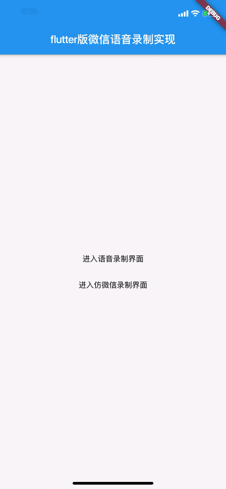
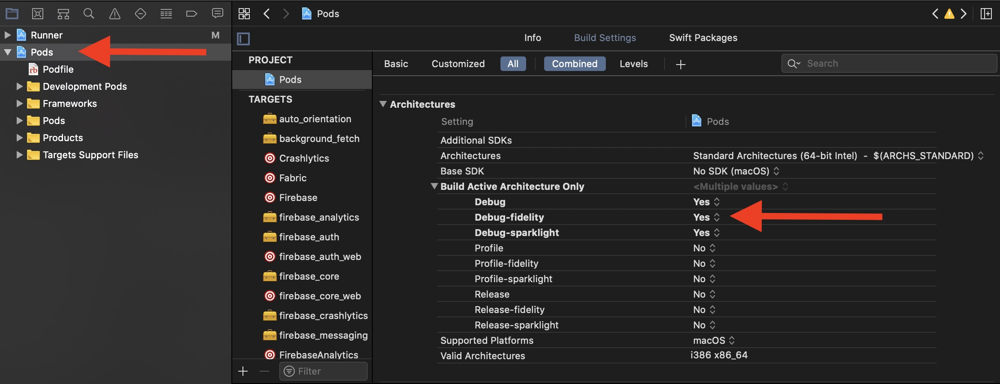

[TOC]

# 使用Flutter实现 仿微信录音的插件 
插件支持android 和IOS

-------
插件提供的功能
录制
1. 录制语音,
2. 播放录音,
3. 录制声音大小的监听
4. 提供录制时长的监听
5. 提供类似微信的录制组件
6. 提供播放音频结束的监听
7. 提供根据传递的路径进行语音录制
8. 提供录制wav,mp3格式  具体可参考example

播放
1. 提供播放指定路径的音频文件
2. 提供播放指定Url地址的wav,MP3格式文件
3. 提供播放完成的回调监听
4. 提供暂停和继续播放的功能
5. 提供停止播放的功能

## 1,引入
在pubspec.yaml 文件上引入如下配置

    引入方式1(引入最新的版本)
    flutter_plugin_record:
        git:
          url: https://github.com/yxwandroid/flutter_plugin_record.git
    
    引入方式2 (引入指定某次commit)
    flutter_plugin_record:
        git:
          url: https://github.com/yxwandroid/flutter_plugin_record.git
          ref: 29c02b15835907879451ad9f8f88c357149c6085
          
    引入方式3 (引入Flutter仓库的library)
          
    dependencies:
      flutter_plugin_record: ^1.0.1
              
              
          
          
          
          
        

### 使用
### 1, 初始化录制
#### 1.1, 初始化录制(wav)
可以在页面初始化的时候进行初始化比如: 在initState方法中进行初始化

    //实例化对象 
    FlutterPluginRecord   recordPlugin = new FlutterPluginRecord();
    //    初始化
    recordPlugin.init()
   

#### 1.2, 初始化录制(Mp3)
可以在页面初始化的时候进行初始化比如: 在initState方法中进行初始化

    //实例化对象 
    FlutterPluginRecord   recordPlugin = new FlutterPluginRecord();
    //    初始化
    recordPlugin.initRecordMp3()

### 2, 开始录制
   
     recordPlugin.start()
     
### 3, 停止录制

     recordPlugin.stop()
     
### 4, 播放

#### 1,播放
     
     recordPlugin.play()
     
#### 2, 暂停和继续播放
       
     recordPlugin.pausePlay();

#### 3, 停止播放
    
     recordPlugin.stopPlay();
          
### 5, 根据传递的路径进行语音录制

     recordPlugin.startByWavPath(wavPath);
     
### 6, 根据传递的路径或则Url进行语音播放

     
      ///
      /// 参数 path  播放音频的地址
      ///
      ///path 为 url类型对应的在线播放地址   https://linjuli-app-audio.oss-cn-hangzhou.aliyuncs.com/audio/50c39c768b534ce1ba25d837ed153824.wav
      ///path 对应本地文件路径对应的是本地文件播放肚子   /sdcard/flutterdemo/wiw.wav
      /// 参数  type
      /// 当path 为url   type为 url
      /// 当path 为本地地址 type为 file
      ///
      Future playByPath(String path, String type) async {
        return await _invokeMethod('playByPath', <String, String>{
          "play": "play",
          "path": path,
          "type": type,
        });
      }   

### 7, 释放资源
可以在页面退出的时候进行资源释放 比如在  dispose方法中调用如下代码

     recordPlugin.dispose()
     
     
     
### 4,回调监听  
1,初始化回调监听  

  
    ///初始化方法的监听
    recordPlugin.responseFromInit.listen((data) {
      if (data) {
        print("初始化成功");
      } else {
        print("初始化失败");
      }
    });
    

2,开始录制停止录制监听

     /// 开始录制或结束录制的监听
        recordPlugin.response.listen((data) {
          if (data.msg == "onStop") {
            ///结束录制时会返回录制文件的地址方便上传服务器
            print("onStop  " + data.path);
          } else if (data.msg == "onStart") {
            print("onStart --");
          }
        });
    
3,录制声音大小回调监听

     ///录制过程监听录制的声音的大小 方便做语音动画显示图片的样式
        recordPlugin.responseFromAmplitude.listen((data) {
          var voiceData = double.parse(data.msg);
          var tempVoice = "";
          if (voiceData > 0 && voiceData < 0.1) {
            tempVoice = "images/voice_volume_2.png";
          } else if (voiceData > 0.2 && voiceData < 0.3) {
            tempVoice = "images/voice_volume_3.png";
          } else if (voiceData > 0.3 && voiceData < 0.4) {
            tempVoice = "images/voice_volume_4.png";
          } else if (voiceData > 0.4 && voiceData < 0.5) {
            tempVoice = "images/voice_volume_5.png";
          } else if (voiceData > 0.5 && voiceData < 0.6) {
            tempVoice = "images/voice_volume_6.png";
          } else if (voiceData > 0.6 && voiceData < 0.7) {
            tempVoice = "images/voice_volume_7.png";
          } else if (voiceData > 0.7 && voiceData < 1) {
            tempVoice = "images/voice_volume_7.png";
          }
          setState(() {
            voiceIco = tempVoice;
            if(overlayEntry!=null){
              overlayEntry.markNeedsBuild();
            }
          });
    
          print("振幅大小   " + voiceData.toString() + "  " + voiceIco);
        });
    
    
    
    
    
    
    
       
   
4,播放声音完成的监听监听
     
   
      recordPlugin.responsePlayStateController.listen((data){
      print("播放路径   " + data.playPath );
      print("播放状态   " + data.playState );
    });
    
    
    
## 2,录制组件的使用

组件使用效果

android效果

<!---->

IOS效果

<!---->

### 1,在使用的页面进行导入package

    import 'package:flutter_plugin_record/index.dart';  
        
    
    

    
### 2,在使用的地方引入VoiceWidget组件
    
    VoiceWidget(),
    
    
    VoiceWidget({startRecord: Function, stopRecord: Function}) {
    
   
    
startRecord 开始录制的回调 

stopRecord 停止录制的回调 返回的path是录制成功之后文件的保存地址

    
     
## IOS配置注意事项
 
### ios集成的的时候需要在info.list添加 
 
     
     <key>NSMicrophoneUsageDescription</key>
            <string>打开话筒</string>

     <key>NSAppTransportSecurity</key>
     	<dict>
     		<key>NSAllowsArbitraryLoads</key>
     		<true/>
     	</dict>

### ios release 打包失败配置注意事项

<!---->

 
## android配置注意事项
 
### android 集成的的时候需要在application标签下添加 
 
     
      tools:replace="android:label"
     

  
## TODO

* [ ] 双声道切换 单声道切换

## 感谢

[肖中旺](https://github.com/xzw421771880)对IOS 播放在线Wav的支持 

## 作者的其他开源项目推荐

[基于腾讯云点播封装的flutter版的播放器插件 ](https://github.com/yxwandroid/flutter_tencentplayer_plus)

[Flutter 二维码扫描插件](https://github.com/yxwandroid/flutter_plugin_qrcode)

[抖音开发平台SDK Flutter插件](https://github.com/yxwandroid/flutter_plugin_douyin_open)

[FLutter地图插件](https://github.com/yxwandroid/flutter_amap_location)

[Flutter 模板工程](https://github.com/yxwandroid/flutter_app_redux.git)

## 关注公众号获取更多内容

